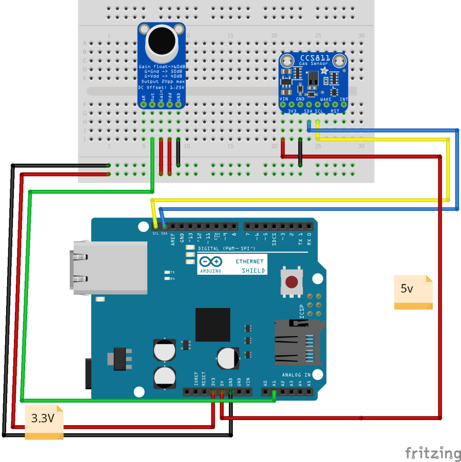

# Citizension-Smart-Kozani-IoT-System

## Description
Το παρών αποθετήριο αποτελεί μια συνέχεια του σεναρίου Smart Buildings and the internet of things (Έξυπνα Κτίρια και Διαδίκτυο των πραγμάτων), αλλά με τους αισθητήρες Adafruit MAX9814 και Adafruit CCS811 από τους οποίους τα δεδομένα στέλνονται στην πλατφόρμα Ubidots.

Στο αποθετήριο υπάρχουν το σχηματικό της κάθε φάσης τα οποία δημιουργήθηκαν με την χρήση του εργαλείου fritzing και ο κώδικας Arduino. Για περισσότερες πληροφορίες: https://ieee.cs.uowm.gr/citizension/citizension-of-smart-kozani/. 

Η ανάλυση των αισθητήρων υπάρχει στον παρακάτω σύνδεσμο: https://ieee.cs.uowm.gr/citizension/analysi-aisthitiron/. Και ο εξοπλισμός υπάρχει: https://ieee.cs.uowm.gr/citizension/exoplismos/

## Tools needed
- 1 x Arduino Uno
- 1 x Ethernet Shield
- 1 x Breadboard 
- 10 x Jumper Cables 
- 1 x Adafruit MAX9814
- 1 x Adafruit CCS811

## Installation 
- Κατέβασε τον κώδικα.
- Άνοιξε το  Arduino IDE και ανοίχτε τον κώδικα.
- Άνοιξε το serial port monitor.

## Usage
- Μπορείς αν θες να κατεβάσεις το Fritzing απο εδω: http://fritzing.org/download/ έτσι ώστε να μπορείς να αλλάξεις τον κώδικα.
